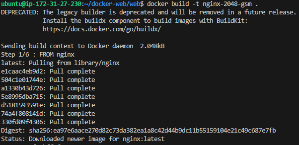
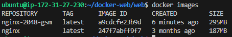
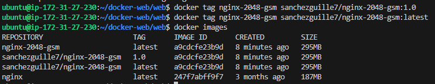
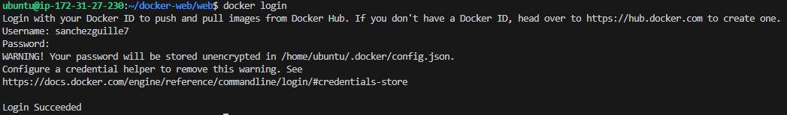
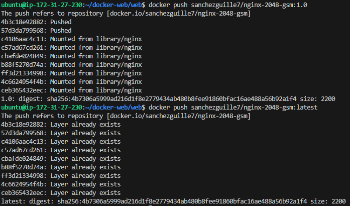
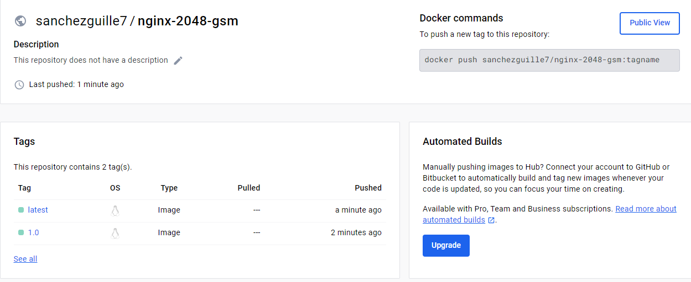
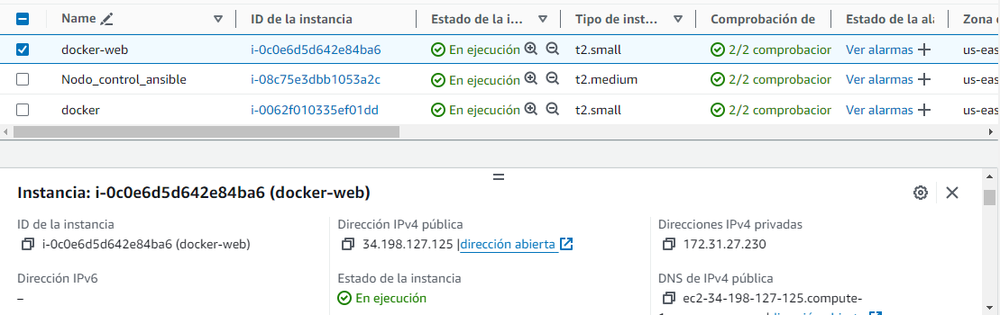
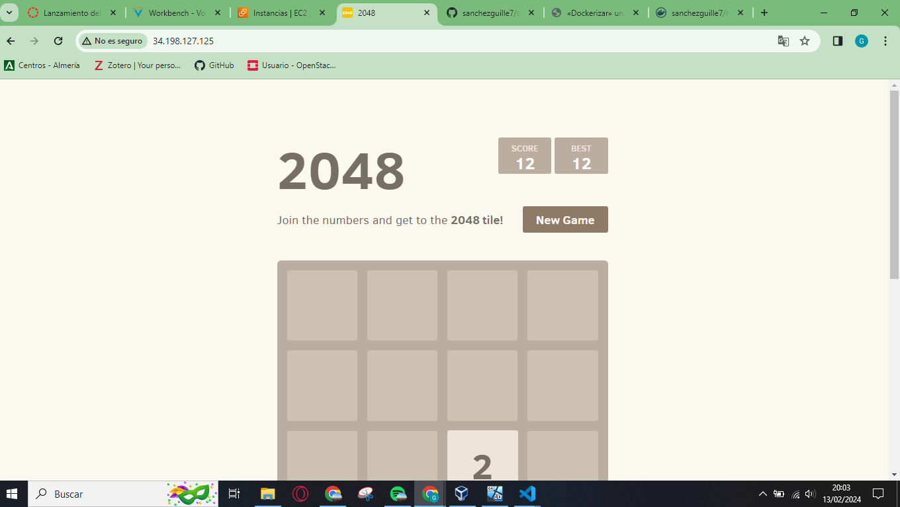
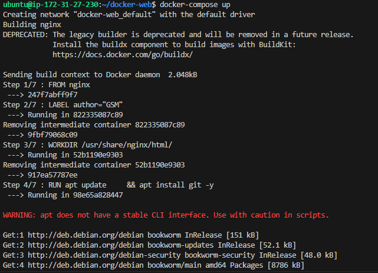

# «Dockerizar» una web estática y publicarla en Docker Hub
En esta práctica, he tenido que crear un archivo **Dockerfile** para generar una imagen **Docker** que incluya una aplicación web estática. Luego, la publico en **Docker Hub** y realizo la implementación del sitio web en **Amazon Web Services (AWS)** utilizando contenedores **Docker** y **Docker Compose**.

## Requisitos del archivo Dockerfile 
Debo crear un archivo **Dockerfile** que cumpla con los siguientes requisitos:

1.  Utilizar la última versión de **nginx** como imagen base.
2.  Instalar el software necesario para clonar el repositorio de **GitHub** que contiene la aplicación web estática.
3.  Clonar el repositorio de **GitHub** que contiene la aplicación web estática en el directorio `/usr/share/nginx/html/`, que es el directorio por defecto utilizado por **Nginx** para servir contenido.
4.  Utilizar el puerto **80** para ejecutar el servicio de **Nginx** dentro de la imagen.
5.  Ejecutar el comando `nginx -g 'daemon off;'` al iniciar el contenedor.

## Creación de la imagen Docker a partir del archivo Dockerfile
Para crear la imagen de **Docker** a partir del archivo **Dockerfile** deberá ejecutar el siguiente comando.

  

    docker build -t nginx-2048-gsm .

Comprobacion:

Para publicar la imagen en **Docker Hub** es necesario que en el nombre de la imagen aparezca nuestro nombre de usuario de **Docker Hub**. En mi caso: *sanchezguille7/nginx-2048-gsm*.
Le añadimos etiquetas o tags:

    docker tag nginx-2048-gsm sanchezguille7/nginx-2048-gsm:1.0
    docker tag nginx-2048-gsm sanchezguille7/nginx-2048-gsm:latest

## Publicar la imagen en Docker Hub

Una vez que le hemos asignado un nombre correcto a la imagen y le hemos añadido las etiquetas, podemos publicarla en **Docker Hub**.

Lo primero que tenemos que hacer es iniciar sesión en **Docker Hub** desde nuestra instancia de **AWS** con el comando donde pondremos nuestros credenciales de **Docker Hub**:

    docker login

Para publicar la imagen con las dos etiquetas que hemos creado:

    docker push sanchezguille7/nginx-2048-gsm:1.0

    docker push sanchezguille7/nginx-2048-gsm:latest

  Se puede comprobar la creación en mi perfil de **Docker Hub**(si pinchas en la imagen te lleva directamente):
  

( https://hub.docker.com/repository/docker/sanchezguille7/nginx-2048-gsm/general )

## Comprobacion de que funciona
IP elastica de mi máquina de AWS:

Pagina web estática:

Comando para lanzarlo:

